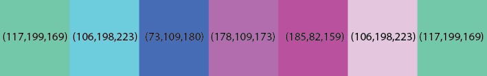
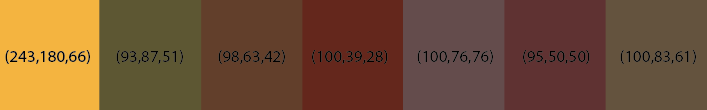
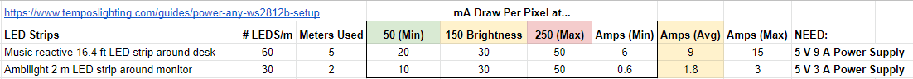
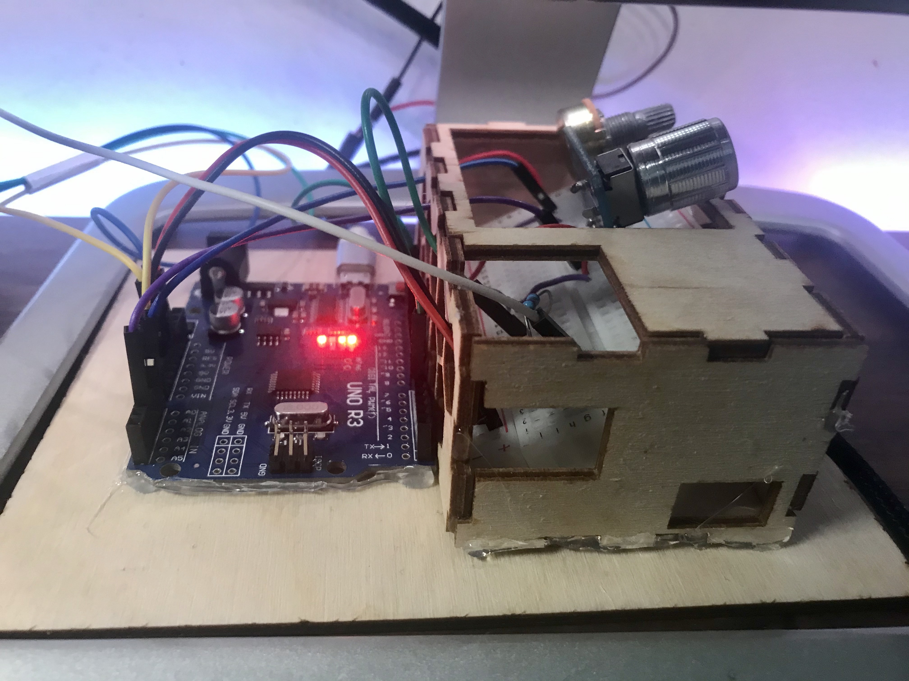
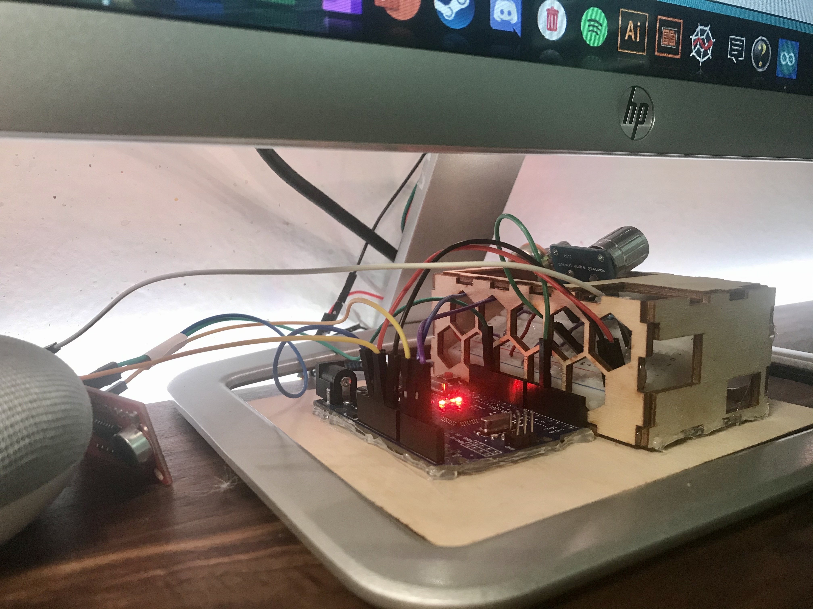
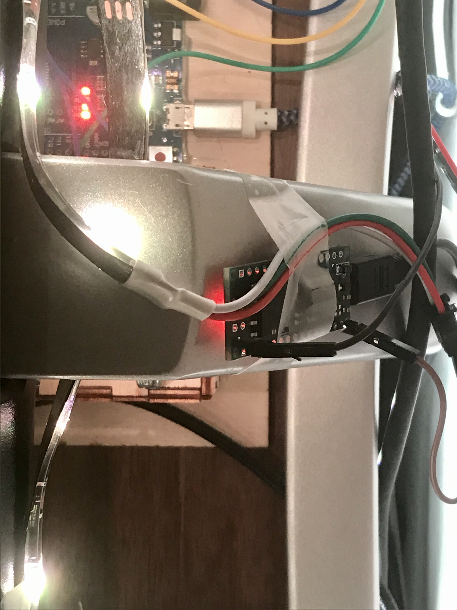

## Personal Notes:

This project is from Grensom: http://www.gregensom.com

This project programs WS2812B addressable LED strips using an Arduino Uno to act as a Music Visualizer. The LED strip will cycle through a given color palette depending on the volume of the music. A "pulse" will be fired according to the rhythm of the music. See demo below.

All credits go to him for the development of this code. Look at the schematics in the "schematics" folder to see the circuit diagrams (based on Arduino Uno). I made 2 adjustments to the program to tailor it to my own personal setup:

1. I don't have a brightness potentiometer so I have a constant set brightness in the code.
2. I also reprogrammed the color palette to fit my personal aesthetic. There are 2 included palettes in the program(RGB values included) as shown below. 

- Vaporwave (blue, green, purple)

- Warm Pastels (light yellow, blue, pink)
(I know these colors don't look the best on screen, but they are visualized quite beautifully on the actual LED strip).

Of course, you can define your own color palette according to your taste by following this LED strip color guide:
http://www.downtownuplighting.com/rgb-color-chart

### Additional Monitor Backlight Program:

One program that I did develop is the script "monitor_lights.ino" for adding LED strips to the back of the monitor for backlighting. I attached an Arduino Nano to 2 meters of LED strips affixed in a rectangular around the back border of the monitor. Note that this is a set color and is not music reactive (although if you want them to be music reactive you can simply reupload the same code to the 2nd Arduino). Future work could include turning the backlight into an Ambilight setup (where the LED strips would detect the colors on the screen and match them accordingly).

#### Monitor Backlight Wiring:
The wiring for the monitor backlight is super simple and involves about 4 wires. You might need one of the DC plug barrel adapters to attach power and ground wires to your 5V power supply: https://www.amazon.com/dp/B079R9WCG2/?coliid=I2RIGU50RG12PE&colid=266S42T52JSTW&psc=1&ref_=lv_ov_lig_dp_it

1. Connect the power wire from the power supply to the power line on the LED strip.
2. Connect a wire from any Data pin (I used D13) from the Arduino Nano to the data line on the LED strip/
3. Connect the ground wire from the power supply to the ground of the LED strip.
4. Connect a second ground wire from the power supply to the ground of the Arudino Nano.

https://www.temposlighting.com/guides/power-any-ws2812b-setup

### Power:

I also realized that Grensom did not really talk about the power requirements for WS2812B LED strips. You will need a 5V DC power supply, but the following link helped me a lot in figuring out how many amps of current I needed for the strips (depends on your brightness settings and number of LEDs):

https://www.temposlighting.com/guides/power-any-ws2812b-setup

Based off the LED Pixel current vs. Brightness value graph, I created a quick Excel table to figure out my power requirements for my setup so I could purchase the appropriate 5V DC power supply:

----------------------------------------------------------
STEP 1: Download the needed Libraries
----------------------------------------------------------
You will need the following libraries:

FastLED.h

LiquidCrystal.h (optional if using LCD Screen)

You can get these by going to Arduino IDE >> Sketch >> Include Library >> Manage Libraries >> "search for" FastLED and install library

----------------------------------------------------------
STEP 2: Choose the Appropriate File to Upload to Arduino
----------------------------------------------------------
1. Led_audio.ino
- this file simply takes audio input from Sound Detector Module and converts it into colored spectrum on LED Strip

2. Led_audio_cycle.ino
- this file has audio spectrum, manual cycle and auto cycle built into it with main potentiometer(see below)

3. Led_audio_cycle_bright_sens.ino
- this file has audio spectrum, manual cycle and auto cycle built into it with main potentiometer(see below) plus allows you to adjust brightness and sensitivity of audio sensor with another two potentiometers

4. Led_audio_cycle_bright_sens_display.ino
- this is the same as #3 but the brightness and sensitivity is displayed on a 16x2 LED Display (requires the LiquidCrystal.h library)

5. desk_lights.ino
- this file is the same as #3 but without the brightness potentiometer (the one I am currently using). To build this circuit, you can use the same schematic as #3 without hooking up the brightness potentiometer.
----------------------------
Main Potentiometer (0-10VDC)
----------------------------
0-1VDC: Audio Spectrum Setting

1-9VDC: Manual Color Cycle Setting (Stays on Color you choose)

9-10VDC: Auto Color Cycle (will slowly cycle through the color spectrum)

----------------------------------------------------------
STEP 3: Wire the Project based on the Arduino Code Used
----------------------------------------------------------

Use the corresponding Schematics files to wire up the components in the project based on the Arduino Sketch you are using:

1. Led_audio.ino = Schematic 1

2. Led_audio_cycle.ino = Schematic 2

3. Led_audio_cycle_bright_sens.ino AND desk_lights.ino = Schematic 3

4. Led_audio_cycle_bright_sens_display.ino = Schematic 4

#### My Arduino Uno Setup for the Music Visualizer:
As shown, I put the sound module right next to my Google Home so that it could easily pick up the music.

 

#### My Arduino Nano Setup for the Monitor Backlight:

----------------------------------------------------------
STEP 4: ENJOY
----------------------------------------------------------
